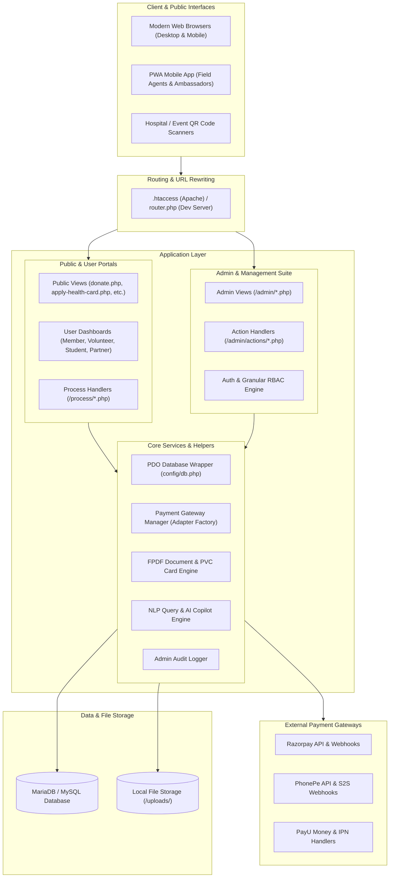
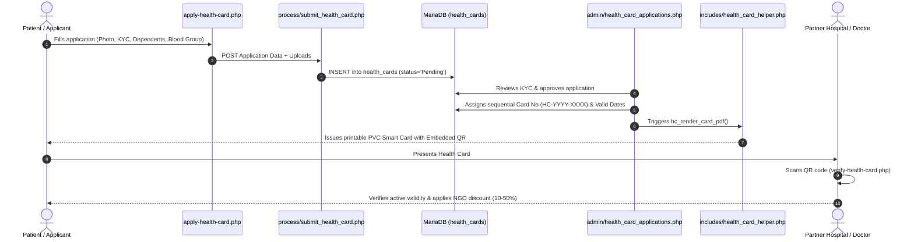

# 🏛️ NGO AI Platform - Master System Architecture & Software Architect Guide

> **Document Version**: 3.0 (Enterprise Architecture Edition)  
> **Prepared For**: Chief Technology Officer (CTO), Lead Architects, and Senior Engineering Teams  
> **Platform Scope**: Full-Stack Monolithic Enterprise PHP System (Public Portal, Multi-Role Admin Suite, Subsystems & API Layer)

---

## Executive Summary: How to Present This Platform to Your CTO

If you need to explain this platform to your **CTO**, present it as:

> *"A modular, high-throughput, secure PHP 8.x + MariaDB ecosystem tailored for NGO governance, financial transparency, digital identity issuance, multi-channel payments, and grassroots field operations. It combines an extensible multi-gateway payment engine (Razorpay, PhonePe, PayU), an automated vector/FPDF document generation pipeline (PVC Smart Health Cards, 80G Tax Receipts, Legal MoUs, Identity Cards), a Hybrid Role-Based Access Control (RBAC) engine with granular permissions, a gamified Student Ambassador network, and an embedded natural-language AI copilot for operational analytics."*

---

## 📑 Table of Contents
1. [High-Level Architecture & Tech Stack](#1-high-level-architecture--tech-stack)
2. [End-to-End Directory & File Structure](#2-end-to-end-directory--file-structure)
3. [Deep-Dive: Core Business Modules](#3-deep-dive-core-business-modules)
   - [3.1 Swasthya Seva Health Card System](#31-swasthya-seva-health-card-system)
   - [3.2 Donations, 80G Tax Receipts & Recurring AutoPay](#32-donations-80g-tax-receipts--recurring-autopay)
   - [3.3 Payment Gateway & Transaction Processing Engine](#33-payment-gateway--transaction-processing-engine)
   - [3.4 Membership CRM & Identity Verification Studio](#34-membership-crm--identity-verification-studio)
   - [3.5 Student Ambassador Network & Gamification](#35-student-ambassador-network--gamification)
   - [3.6 Beneficiary CRM & Welfare Assistance Tracking](#36-beneficiary-crm--welfare-assistance-tracking)
   - [3.7 Field Agent Fleet, GPS Attendance & Cash Reconciliations](#37-field-agent-fleet-gps-attendance--cash-reconciliations)
   - [3.8 Document Studio, WYSIWYG Builder & Legal Agreements](#38-document-studio-wysiwyg-builder--legal-agreements)
   - [3.9 Financial Management & Accounting (P&L, Expenses)](#39-financial-management--accounting-pl-expenses)
   - [3.10 AI Assistant, Natural Language Querying & Analytics](#310-ai-assistant-natural-language-querying--analytics)
4. [Security Architecture & RBAC Matrix](#4-security-architecture--rbac-matrix)
5. [Software Architect Guide: Blueprint for Adding New Modules](#5-software-architect-guide-blueprint-for-adding-new-modules)
   - [Step 1: Database Migration & Schema Conventions](#step-1-database-migration--schema-conventions)
   - [Step 2: RBAC & Permission Registration](#step-2-rbac--permission-registration)
   - [Step 3: Building Admin Controller & Views](#step-3-building-admin-controller--views)
   - [Step 4: Building Public Web Flow & Process Handlers](#step-4-building-public-web-flow--process-handlers)
   - [Step 5: Payment Gateway Integration](#step-5-payment-gateway-integration)
   - [Step 6: PDF & QR Code Generation Integration](#step-6-pdf--qr-code-generation-integration)
   - [Step 7: REST API Endpoint Registration](#step-7-rest-api-endpoint-registration)
6. [Data Flow Diagrams](#6-data-flow-diagrams)

---

## 1. High-Level Architecture & Tech Stack



### 1.1 Technology Stack Summary
| Layer | Technologies & Libraries | Key Responsibilities |
| :--- | :--- | :--- |
| **Backend Runtime** | PHP 8.1+ (Object-Oriented + Functional Controllers) | Request lifecycle, validation, business rules, transactional logic |
| **Database** | MariaDB 10.4+ / MySQL 5.7+ with `PDO` | Structured storage, foreign keys, transaction rollbacks, index tuning |
| **Frontend Layout** | Tailwind CSS + Google Fonts (Outfit, Inter) | Modern styling, glassmorphism, responsive grid layouts |
| **Client Reactivity** | Alpine.js v3 + Vanilla JS | Dynamic modals, reactive forms, real-time calculations, AJAX bindings |
| **Document Generator** | Custom FPDF Extension (`libs/fpdf/`) | PDF generation for 80G receipts, smart cards, certificates, letters |
| **QR Code Engine** | Multi-Tier QR System (`api.qrserver.com` + Local Cache) | Dynamic verification QR codes embedded in identity cards & receipts |
| **Payment Gateways** | Razorpay, PhonePe, PayU, Manual UPI/Cash | Multi-adapter payment switching with cryptographic signature validation |
| **AI Copilot** | Native PHP NLP Engine (`api/ai_chat.php`) | Analytical database querying, intent parsing, document auto-drafting |

---

## 2. End-to-End Directory & File Structure

```
├── .htaccess                       # Production URL rewriting engine (Apache)
├── router.php                      # Local dev server routing & clean URL mapper
├── Database.sql                    # Master database schema & seed data
├── index.php                       # Public home page
├── donate.php                      # Public donation portal (Online & Offline)
├── donate-items.php                # Public in-kind donation portal (Food, clothes, etc.)
├── apply-health-card.php           # Public health card application & renewal form
├── verify-health-card.php          # Public instant QR health card verification
├── download-health-card.php        # Instant PDF download for approved health cards
├── download-receipt.php            # Secure hash-verified 80G tax receipt download
├── healthcare-directory.php        # Searchable directory of partner hospitals & doctors
├── student-dashboard.php           # Student ambassador portal (Tasks, points, ranking)
├── volunteer-dashboard.php         # Volunteer activity log & digital ID portal
├── partner-dashboard.php           # Healthcare provider & doctor partner portal
│
├── admin/                          # ── ADMINISTRATIVE BACKEND SUITE ──
│   ├── index.php                   # Admin login gateway with CSRF
│   ├── dashboard.php               # Master operations & KPI analytics dashboard
│   ├── access_control.php          # Granular RBAC & permissions matrix editor
│   ├── ai_assistant.php            # Natural language database copilot
│   ├── donations.php               # Monetary donations master ledger
│   ├── generate_receipt.php        # 80G tax receipt generator
│   ├── recurring_donations.php     # Recurring AutoPay subscription manager
│   ├── health_card_applications.php# Health card verification & issuance pipeline
│   ├── healthcare_directory.php    # Empaneled clinics/hospitals directory manager
│   ├── doctor_agreements.php       # Doctor MoU contracts & certificate generator
│   ├── memberships.php             # Membership CRM & KYC review
│   ├── document_studio.php         # Unified certificate & document generation studio
│   ├── template-builder.php        # Drag-and-drop WYSIWYG certificate template designer
│   ├── letters.php / letter_editor # Official letterhead composer & sequence generator
│   ├── student_directory.php       # Student ambassador fleet management
│   ├── student_tasks.php           # Task creation & proof review pipeline
│   ├── beneficiaries.php           # Beneficiary profiling (BPL, Divyangjan, Widows)
│   ├── beneficiary_assistance.php  # Direct welfare aid disbursal ledger
│   ├── field-agents.php            # Field agent fleet management
│   ├── agent-attendance.php        # GPS punch-in & daily agent tracking
│   ├── cash-deposits.php           # Cash collection & bank deposit reconciliation
│   ├── agent-payroll.php           # Monthly agent salary & commission ledger
│   ├── expenses.php                # Operational voucher & expense tracking
│   ├── income_vs_expense.php       # Real-time financial P&L balance sheet
│   ├── settings.php                # System branding, gateway keys, SMTP, SMS setup
│   ├── audit_logs.php              # Immutable administrator activity trail
│   ├── actions/                    # ── ADMIN BACKEND ACTION CONTROLLERS (74 Controllers) ──
│   │   ├── donation_logic.php      # Approve/reject offline donations, issue receipts
│   │   ├── health_card_logic.php   # Approve/reject cards, assign card numbers
│   │   ├── expense_logic.php       # Voucher CRUD & scanned invoice attachments
│   │   ├── beneficiary_logic.php   # Beneficiary profile & aid allocation logic
│   │   ├── access_control_logic.php# Save permission overrides per staff user
│   │   ├── export_pdf.php          # Financial & operational report exports
│   │   └── ...                     # (Dedicated controllers for every module)
│   └── includes/
│       ├── header.php / navbar.php # Standardized responsive admin header & navigation
│       ├── sidebar.php             # Permission-aware dynamic collapsible sidebar
│       └── footer.php              # Scripts, Alpine modals, notifications
│
├── api/                            # ── RESTful & AJAX JSON ENDPOINTS ──
│   ├── _bootstrap.php              # API rate-limiting, CORS, session initialization
│   ├── ai_chat.php                 # 142KB native NLP query & database copilot engine
│   ├── create_donation_order.php   # Initialize payment gateway order
│   ├── submit_donation.php         # Donation submission handler
│   ├── recurring_donations.php     # Subscription mandate management
│   └── ...                         # (Public lookup and submission APIs)
│
├── config/                         # ── CORE CONFIGURATION ──
│   ├── db.php                      # PDO connection (UTF8MB4, Emulate prepares false)
│   └── razorpay.php                # Razorpay default credentials & constants
│
├── database/                       # ── SQL MIGRATIONS & SCHEMAS ──
│   ├── create_health_cards.sql
│   ├── create_recurring_donations.sql
│   ├── create_healthcare_panel.sql
│   ├── create_expense_management.sql
│   └── ...                         # Individual module migrations
│
├── includes/                       # ── SYSTEM CORE HELPERS & SERVICES ──
│   ├── functions.php               # Core framework (RBAC, CSRF, flash, receipt sequences)
│   ├── health_card_helper.php      # FPDF PVC Smart Card generator with QR
│   ├── custom_receipt_helper.php   # Multi-line item custom invoice & receipt generator
│   ├── doctor_certificate_helper.php# Doctor affiliation certificate renderer
│   ├── india_locations.php         # State & district datasets for all 36 Indian states
│   ├── letterhead_helper.php       # Organization letterhead PDF renderer
│   ├── member_module.php           # Membership card & receipt helper
│   ├── payments/                   # ── UNIFIED PAYMENT GATEWAY ENGINE ──
│   │   ├── PaymentGatewayInterface.php # Gateway standard contract
│   │   ├── PaymentGatewayManager.php   # Central factory & settings resolver
│   │   ├── RazorpayGatewayAdapter.php  # Razorpay SDK & Webhook implementation
│   │   ├── PhonePeGatewayAdapter.php   # PhonePe Redirect & S2S handler
│   │   └── PayUGatewayAdapter.php      # PayU Money form & IPN implementation
│   └── student/                    # Student referral & achievement engines
│
├── membership/                     # ── MEMBERSHIP SUB-PORTAL ──
│   ├── member-register.php         # Public membership KYC registration
│   ├── member-login.php            # OTP-based secure member authentication
│   ├── member-dashboard.php        # Member ID, documents, payment history
│   └── member-verify.php           # Public QR authentication for membership cards
│
├── process/                        # ── PUBLIC FORM PROCESSORS & WEBHOOKS ──
│   ├── submit_donation.php         # One-time donation processor
│   ├── create_razorpay_order.php   # Gateway order creation endpoint
│   ├── verify_razorpay_payment.php # Gateway signature verification & receipt dispatch
│   ├── razorpay_webhook.php        # Server-to-server Razorpay webhook listener
│   ├── phonepe_webhook.php         # Server-to-server PhonePe webhook listener
│   ├── payu_webhook.php            # Server-to-server PayU IPN listener
│   ├── submit_health_card.php      # Health card application & renewal processor
│   ├── fetch_health_card_lookup.php# Fast auto-fill for card renewals
│   ├── create_recurring_subscription.php # AutoPay subscription initializer
│   ├── collect_donation.php        # Field agent on-ground cash collection
│   └── deposit_cash.php            # Agent bank deposit reconciliation
│
├── libs/                           # ── THIRD-PARTY LIBRARIES ──
│   └── fpdf/                       # FPDF vector PDF generation library
└── uploads/                        # ── SECURE FILE REPOSITORY ──
    ├── donations/                  # Scanned payment slips
    ├── health_cards/               # Beneficiary photos & medical cards
    ├── members/                    # KYC proofs & member photos
    └── expenses/                   # Scanned vendor bills & receipts
```

---

## 3. Deep-Dive: Core Business Modules

### 3.1 Swasthya Seva Health Card System
The Health Card System provides underprivileged families with access to subsidized healthcare through empaneled partner hospitals, clinics, diagnostic labs, and pharmacies.



#### Key Components:
1. **Application & Renewal Workflow** (`apply-health-card.php`):
   - Supports both **New Applications** and **1-Click Renewals**.
   - Includes instant lookup (`process/fetch_health_card_lookup.php`) by Card Number or Mobile Number to auto-fill applicant information.
   - Dynamic dependent family members grid (Relationship, Age, Gender, Pre-existing conditions).
   - District & State cascading dropdown powered by `includes/india_locations.php`.
2. **Sequential Card Number Engine** (`hc_generate_card_number()`):
   - Generates formatted identifiers: `HC-2026-0001`, `HC-2026-0002`.
3. **PVC Smart Card Vector Generator** (`includes/health_card_helper.php`):
   - Standard CR80 PVC dimensions ($85.6\text{ mm} \times 54.0\text{ mm}$).
   - High-resolution rounded card container, official NGO branding, applicant photograph, blood group badge, validity window, and **Live Dynamic Verification QR Code**.
4. **Partner Hospital & Doctor Agreement Integration** (`admin/doctor_agreements.php`):
   - Links partner healthcare institutions (`healthcare_providers`) with formal MoUs.
   - Generates Doctor Affiliation Certificates (`includes/doctor_certificate_helper.php`) and tracks concession percentages across OPD, IPD, Diagnostics, and Pharmacy bills.

---

### 3.2 Donations, 80G Tax Receipts & Recurring AutoPay
A complete financial contribution system supporting one-time payments, emergency crowdfunding campaigns, recurring monthly auto-debits, in-kind item donations, and on-the-ground agent collections.

```mermaid
flowchart TD
    Donor([Donor]) --> Choice{Donation Type}

    %% Online Flow
    Choice -->|Online Donation| OnlineForm[donate.php]
    OnlineForm --> GatewayInit[process/create_razorpay_order.php]
    GatewayInit --> CheckoutModal[Razorpay / PhonePe SDK Modal]
    CheckoutModal -->|Success| VerifyHandler[process/verify_razorpay_payment.php]
    VerifyHandler --> CheckHMAC{Verify Signature}
    CheckHMAC -->|Valid| MarkSuccess[Mark Status = 'Success']
    MarkSuccess --> Gen80G[Generate 80G Receipt Number]
    Gen80G --> ThankYou[thankyou.php + Download PDF]

    %% Offline Flow
    Choice -->|Offline UPI / Bank / Cash| OfflineForm[donate.php (Manual Mode)]
    OfflineForm --> UploadProof[Upload Payment Screenshot + Txn ID]
    UploadProof --> SavePending[Mark Status = 'Pending']
    SavePending --> CoordinatorReview[admin/donations.php Review]
    CoordinatorReview -->|Approve| ApproveAction[admin/actions/donation_logic.php]
    ApproveAction --> Gen80G

    %% Recurring Flow
    Choice -->|Monthly AutoPay| SubForm[recurring_donations.php]
    SubForm --> RzpSub[Razorpay Subscriptions Plan API]
    RzpSub --> MandateAuth[Donor Mandate Authorization]
    MandateAuth --> SubWebhook[process/razorpay_webhook.php]
    SubWebhook --> LogCharge[Log Recurring Cycle in DB]
```

#### Key Components:
1. **80G Tax-Exempt Receipt Generation** (`generateNextDonationReceiptNumber()`):
   - Formats unique sequence: `RCP-YYYY-00001`.
   - Validates Indian Income Tax PAN regex: `[A-Z]{5}[0-9]{4}[A-Z]{1}`.
   - Computes amount in words automatically.
   - Generates tamper-proof SHA-256 download tokens (`isValidDonationReceiptToken()`) preventing unauthorized receipt enumeration.
2. **Recurring AutoPay Engine** (`includes/razorpay_subscription_helper.php`):
   - Connects to Razorpay Subscriptions API.
   - Manages recurring schedules (Monthly, Quarterly, Annually).
   - Handles `subscription.charged`, `subscription.cancelled`, and `subscription.halted` events via webhooks.
3. **In-Kind / Physical Item Donations** (`donate-items.php`, `admin/item_donation_categories.php`):
   - Allows donors to contribute food grains, clothing, medical supplies, and books.
   - Tracks units (kg, boxes, kits), pickup locations, and generates In-Kind Donation Verification Receipts (`download-item-receipt.php`).
4. **Custom Receipts Studio** (`admin/generate_custom_receipt.php`):
   - Tailored for institutional sponsorships, CSR grants, and multi-item invoices.
   - Features dynamic line items, real-time total computation, and direct WhatsApp/Email PDF dispatch.

---

### 3.3 Payment Gateway & Transaction Processing Engine
The platform uses the **Adapter Pattern** to deliver a vendor-agnostic payment architecture. Adding a new payment gateway requires zero changes to core business logic.

```
                  ┌───────────────────────────────┐
                  │    PaymentGatewayInterface    │
                  └───────────────┬───────────────┘
                                  │ implements
         ┌────────────────────────┼────────────────────────┐
         │                        │                        │
         ▼                        ▼                        ▼
┌──────────────────┐    ┌──────────────────┐    ┌──────────────────┐
│ Razorpay Adapter │    │ PhonePe Adapter  │    │   PayU Adapter   │
└──────────────────┘    └──────────────────┘    └──────────────────┘
```

#### Gateway Architecture Classes (`includes/payments/`):
* **`PaymentGatewayInterface`**: Unified contract requiring:
  * `createOrder(array $params): array`
  * `verifyPayment(array $payload): array`
  * `verifyWebhook(string $rawBody, array $headers): array`
  * `getWebhookUrl(): string`
* **`PaymentGatewayManager`**:
  * Resolves active gateway from system settings (`settings.active_payment_gateway`).
  * Supports separate keys for Donations vs Memberships.
  * Caches adapter instances per request lifecycle.

#### Transaction Integrity & Webhook Handling (`process/*_webhook.php`):
* **Idempotency Safeguard**: Webhook payloads are hashed and checked against `razorpay_webhook_logs`. If an event was already processed by client-side checkout verification, duplicate DB updates and duplicate receipt numbering are prevented.
* **Database Transactions**: All financial status updates execute inside `PDO::beginTransaction()` / `PDO::commit()` blocks with automatic rollbacks on exception.

---

### 3.4 Membership CRM & Identity Verification Studio
Manages the end-to-end lifecycle of NGO members, volunteers, and executives.

* **Membership Categories**: Annual, Lifetime, Patron, Honorary.
* **KYC & Verification**: Coordinators inspect Aadhaar/Voter IDs and verify payment records before approving.
* **Digital Identity Studio** (`admin/generate_idcard.php`):
  * Issues double-sided PVC printable member cards.
  * Front: Photo, Member ID, Blood Group, Designation, Issue/Expiry Dates.
  * Back: Emergency contact, registered address, authorized seal, and **Public Verification QR Code** (`membership/member-verify.php`).
* **Automated Member Services**:
  * Auto-mailer on approval with attached Welcome Kit.
  * Daily automated birthday dispatch (`admin/actions/send_birthday_wishes.php`).
  * Expiring membership renewal alerts.

---

### 3.5 Student Ambassador Network & Gamification
A campus engagement ecosystem empowering university students to lead fundraising and social drives.

* **Leaderboards & Badges**: Students earn points for verified tasks, event proposals, donor referrals, and partner doctor onboarding.
* **Proof Verification Pipeline** (`admin/student_tasks.php`, `admin/student_submissions.php`):
  * Admin publishes tasks with target participant quotas and point rewards.
  * Students submit photo proofs and geotagged links from their dashboard.
  * Coordinators approve or request revisions; approvals automatically credit points via `StudentAchievementEngine`.
* **Personal QR Codes** (`admin/qr_donations_tracking.php`):
  * Every student ambassador receives a personalized donation QR code.
  * Donations scanned via the student QR code automatically credit referral points to the ambassador's profile.

---

### 3.6 Beneficiary CRM & Welfare Assistance Tracking
A dedicated database for families and individuals receiving direct welfare assistance.

* **Socio-Economic Profiling** (`admin/beneficiaries.php`): Categorizes beneficiaries into *BPL (Below Poverty Line)*, *Divyangjan (Differently Abled)*, *Widows*, *Orphans*, *Senior Citizens*, and *Students*.
* **Aid Disbursal Ledger** (`admin/beneficiary_assistance.php`): Logs every distributed item (Ration Kits, Scholarships, Wheelchairs, Medical Grants) with monetary value, supervising officer, and distribution photo proofs.
* **Audited Exports**: 1-click export of beneficiary impact ledgers to **Audited Excel** and **PDF formats** for statutory audits and CSR reporting.

---

### 3.7 Field Agent Fleet, GPS Attendance & Cash Reconciliations
For on-the-ground fundraising and outreach agents:

* **GPS Punch-in Attendance** (`admin/agent-attendance.php`): Geolocation coordinates, timestamp, and device info are logged daily upon agent check-in.
* **Cash Collection Ledger** (`process/collect_donation.php`): Agents collect cash donations in the field, immediately sending SMS/Email acknowledgements to donors.
* **Bank Deposit Reconciliation** (`admin/cash-deposits.php`): Super Admins reconcile cash collected against verified bank deposit slips before funds are cleared into the general ledger.
* **Automated Agent Payroll** (`admin/agent-payroll.php`): Computes base pay + performance commissions and manages monthly salary disbursements.

---

### 3.8 Document Studio, WYSIWYG Builder & Legal Agreements
Unified document generation suite:

* **WYSIWYG Template Designer** (`admin/template-builder.php`): Drag-and-drop designer for certificates and award letters with dynamic placeholders (`{{member_name}}`, `{{certificate_no}}`, `{{qr_code}}`, `{{date}}`).
* **Official Letterhead Composer** (`admin/letters.php`): Generates formal letters with auto-formatted organization headers, serial numbers, digital stamps, and signatures.
* **Staff HR Letters** (`admin/staff_letters.php`): Issues Offer Letters, Appointment Letters, Experience Certificates, and Relieving Letters.

---

### 3.9 Financial Management & Accounting (P&L, Expenses)
Complete accounting oversight:

* **Voucher & Expense Tracker** (`admin/expenses.php`): Categorizes expenditures (Programmatic Aid, Salaries, Admin Overhead, Medical Aid, Logistics) with scanned vendor bills.
* **Income vs Expense Balance Sheet** (`admin/income_vs_expense.php`): Real-time comparative financial reports highlighting net surplus/deficit across any financial year, exportable to Excel and PDF.

---

### 3.10 AI Assistant, Natural Language Querying & Analytics
Embedded server-side NLP copilot (`api/ai_chat.php` & `admin/ai_assistant.php`):

* Parses natural language questions in English and Hinglish.
* Safely introspects database tables to answer operational queries:
  * *"Show me the total donation collected this month"*
  * *"How many health card applications are pending in Jaipur?"*
  * *"Draft an appreciation letter for Dr. Sharma for the blood donation camp"*

---

## 4. Security Architecture & RBAC Matrix

### 4.1 Hybrid RBAC + Granular Permissions
Access control is implemented in `includes/functions.php` via `canAccessModule($pdo, $required_role, $permission_key)`.

```
                  ┌─────────────────────────────────────────┐
                  │          Super Admin (Level 3)          │
                  │   Full System & Security Configuration  │
                  └────────────────────┬────────────────────┘
                                       │
                  ┌────────────────────▼────────────────────┐
                  │             Manager (Level 2)           │
                  │   Operations, Donations, Projects, CMS  │
                  └────────────────────┬────────────────────┘
                                       │
                  ┌────────────────────▼────────────────────┐
                  │           Coordinator (Level 1)         │
                  │   KYC Verification, Health Cards, ID    │
                  └─────────────────────────────────────────┘
```

* **Granular Overrides**: The `user_permissions` table allows Super Admins to grant or revoke specific permissions (e.g., `page.expenses`, `page.donations`) to individual staff accounts regardless of their base hierarchy level.
* **Security Controls**:
  * CSRF Token validation (`generateCsrfToken()`, `verifyCsrfToken()`) on all state-changing POST requests.
  * Strict Rate Limiting (`rate_limit_check()`) on login and OTP generation endpoints.
  * Session hardening with `session_regenerate_id(true)` upon authentication.
  * SQL Injection protection via parameterized PDO prepared statements throughout the codebase.
  * Comprehensive action audit logging (`admin_audit_logs`).

---

## 5. Software Architect Guide: Blueprint for Adding New Modules

When adding a new module (e.g., *Scholarship Management*, *Disaster Relief Ops*, *Blood Bank Directory*), follow this standard 7-step blueprint:

### Step 1: Database Migration & Schema Conventions
Create a new migration file in `database/create_<module_name>.sql`.

```sql
CREATE TABLE IF NOT EXISTS `scholarship_applications` (
  `id` INT AUTO_INCREMENT PRIMARY KEY,
  `application_no` VARCHAR(50) NOT NULL UNIQUE,
  `student_name` VARCHAR(150) NOT NULL,
  `student_email` VARCHAR(150) NOT NULL,
  `student_phone` VARCHAR(20) NOT NULL,
  `annual_family_income` DECIMAL(10,2) NOT NULL,
  `course_name` VARCHAR(100) NOT NULL,
  `institution_name` VARCHAR(200) NOT NULL,
  `marks_percentage` DECIMAL(5,2) NOT NULL,
  `documents_path` VARCHAR(255) DEFAULT NULL,
  `status` ENUM('Pending', 'Approved', 'Disbursed', 'Rejected') NOT NULL DEFAULT 'Pending',
  `grant_amount` DECIMAL(10,2) DEFAULT 0.00,
  `verified_by` INT DEFAULT NULL,
  `created_at` TIMESTAMP DEFAULT CURRENT_TIMESTAMP,
  `updated_at` TIMESTAMP DEFAULT CURRENT_TIMESTAMP ON UPDATE CURRENT_TIMESTAMP,
  INDEX `idx_status` (`status`),
  INDEX `idx_student_phone` (`student_phone`)
) ENGINE=InnoDB DEFAULT CHARSET=utf8mb4 COLLATE=utf8mb4_unicode_ci;
```

---

### Step 2: RBAC & Permission Registration
Register the module in `includes/functions.php` inside `getAccessModuleCatalog()`:

```php
[
    'group'        => 'Welfare',
    'key'          => 'page.scholarships',
    'label'        => 'Scholarship Management',
    'description'  => 'Review student scholarship applications and manage grant disbursals.',
    'default_role' => 'manager',
]
```

Add the sidebar link in `admin/includes/sidebar.php` wrapped in the permission guard:

```php
<?php if (canAccessModule($pdo, 'manager', 'page.scholarships')): ?>
  <a href="scholarships.php" class="flex items-center gap-3 px-3 py-2.5 rounded-xl text-sm font-medium transition ...">
    <i class="fa-solid fa-graduation-cap text-indigo-500"></i>
    <span>Scholarships</span>
  </a>
<?php endif; ?>
```

---

### Step 3: Building Admin Controller & Views
Create the main view `admin/scholarships.php`:

```php
<?php
require 'includes/header.php';
require '../config/db.php';
require_once '../includes/functions.php';

if (!canAccessModule($pdo, 'manager', 'page.scholarships')) {
    setFlash('error', 'Access denied. Manager privileges required.');
    header('Location: dashboard.php');
    exit;
}

$csrfToken = generateCsrfToken();
$page = max(1, (int)($_GET['page'] ?? 1));
$perPage = 15;
$offset = ($page - 1) * $perPage;

// Fetch filtered applications
$stmt = $pdo->prepare("SELECT * FROM scholarship_applications ORDER BY id DESC LIMIT :limit OFFSET :offset");
$stmt->bindValue(':limit', $perPage, PDO::PARAM_INT);
$stmt->bindValue(':offset', $offset, PDO::PARAM_INT);
$stmt->execute();
$applications = $stmt->fetchAll(PDO::FETCH_ASSOC);
?>

<div class="p-6">
  <!-- Page Header & Metrics Strip -->
  <div class="flex items-center justify-between mb-6">
    <h1 class="text-2xl font-bold text-gray-900">Scholarship Applications</h1>
    <button @click="openCreateModal = true" class="px-4 py-2 bg-indigo-600 text-white rounded-xl font-bold">
      + New Application
    </button>
  </div>

  <!-- Data Table with Pagination -->
  <?php displayFlash(); ?>
  <div class="bg-white rounded-2xl shadow-sm border border-gray-100 overflow-hidden">
    <!-- Table Markup -->
  </div>
</div>

<?php require 'includes/footer.php'; ?>
```

Create the backend action controller `admin/actions/scholarship_logic.php`:

```php
<?php
require_once '../../config/db.php';
require_once '../../includes/functions.php';

if (!canAccessModule($pdo, 'manager', 'page.scholarships')) {
    http_response_code(403);
    exit('Access denied.');
}

if ($_SERVER['REQUEST_METHOD'] === 'POST') {
    if (!verifyCsrfToken($_POST['csrf_token'] ?? '')) {
        setFlash('error', 'Invalid security token.');
        header('Location: ../scholarships.php');
        exit;
    }

    $action = cleanInput($_POST['action'] ?? '');
    $id = filter_input(INPUT_POST, 'id', FILTER_VALIDATE_INT);

    if ($action === 'approve') {
        $grantAmount = filter_input(INPUT_POST, 'grant_amount', FILTER_VALIDATE_FLOAT);
        $stmt = $pdo->prepare("UPDATE scholarship_applications SET status = 'Approved', grant_amount = ?, verified_by = ? WHERE id = ?");
        $stmt->execute([$grantAmount, (int)$_SESSION['user_id'], $id]);

        logAudit($pdo, 'APPROVE_SCHOLARSHIP', 'scholarship_applications', $id, "Approved grant ₹{$grantAmount}");
        setFlash('success', 'Scholarship approved successfully.');
    }

    header('Location: ../scholarships.php');
    exit;
}
```

---

### Step 4: Building Public Web Flow & Process Handlers
Create public application page `scholarship-apply.php` and public processing script `process/submit_scholarship.php`:

```php
<?php
require_once '../config/db.php';
require_once '../includes/functions.php';

if ($_SERVER['REQUEST_METHOD'] === 'POST') {
    if (!verifyCsrfToken($_POST['csrf_token'] ?? '')) {
        setFlash('error', 'Session expired. Please try again.');
        header('Location: ../scholarship-apply.php');
        exit;
    }

    $name = cleanInput($_POST['name'] ?? '');
    $email = filter_var($_POST['email'] ?? '', FILTER_VALIDATE_EMAIL);
    $phone = cleanInput($_POST['phone'] ?? '');
    $income = filter_var($_POST['income'] ?? '', FILTER_VALIDATE_FLOAT);
    $course = cleanInput($_POST['course'] ?? '');
    $institution = cleanInput($_POST['institution'] ?? '');
    $marks = filter_var($_POST['marks'] ?? '', FILTER_VALIDATE_FLOAT);

    $appNo = 'SCH-' . date('Y') . '-' . strtoupper(bin2hex(random_bytes(3)));

    $stmt = $pdo->prepare("INSERT INTO scholarship_applications (application_no, student_name, student_email, student_phone, annual_family_income, course_name, institution_name, marks_percentage) VALUES (?, ?, ?, ?, ?, ?, ?, ?)");
    $stmt->execute([$appNo, $name, $email, $phone, $income, $course, $institution, $marks]);

    setFlash('success', "Application submitted successfully! Your Application ID is {$appNo}.");
    header('Location: ../thankyou.php');
    exit;
}
```

---

### Step 5: Payment Gateway Integration
If the new module involves payments (e.g., application fee or grant co-pay), invoke `PaymentGatewayManager`:

```php
require_once __DIR__ . '/../includes/functions.php';

$gatewayManager = getPaymentGatewayManager($pdo);
$gateway = $gatewayManager->getActiveGateway('donation');

$order = $gateway->createOrder([
    'amount'        => 500.00,
    'order_id'      => 'SCH_ORD_' . time(),
    'customer_name' => $name,
    'customer_email'=> $email,
    'customer_phone'=> $phone,
    'purpose'       => 'Scholarship Application Fee',
]);

echo json_encode($order);
```

---

### Step 6: PDF & QR Code Generation Integration
To generate a branded Certificate or Sanction Letter for the new module:
1. Extend `FPDF` in `includes/scholarship_letter_helper.php`.
2. Use `mm_qr_image_url($verifyUrl)` to generate the verification QR code.
3. Expose a download endpoint `download-scholarship-letter.php` secured by `isValidDonationReceiptToken()`.

---

### Step 7: REST API Endpoint Registration
Expose RESTful endpoints in `api/scholarships.php`:

```php
<?php
require_once __DIR__ . '/_bootstrap.php';

if ($_SERVER['REQUEST_METHOD'] === 'GET') {
    $phone = cleanInput($_GET['phone'] ?? '');
    $stmt = $pdo->prepare("SELECT application_no, student_name, course_name, status, grant_amount FROM scholarship_applications WHERE student_phone = ?");
    $stmt->execute([$phone]);
    $results = $stmt->fetchAll(PDO::FETCH_ASSOC);

    echo json_encode(['success' => true, 'data' => $results]);
    exit;
}
```

---

## 6. Data Flow Diagrams

### Comprehensive System Data Flow

```mermaid
flowchart LR
    subgraph Inputs [User Interactions]
        D_In[Donations & Crowdfunding]
        H_In[Health Card Applications]
        M_In[Membership Signups]
        V_In[Volunteer Registrations]
        S_In[Student Ambassador Tasks]
    end

    subgraph Processing [Controller & Gateway Engine]
        Rzp_P[Razorpay / PhonePe / PayU Engine]
        Proc_P[Process & Action Handlers]
        RBAC_P[RBAC & Audit Logger]
    end

    subgraph Core_DB [Central MariaDB Database]
        DB_Ledger[(Donations & Orders)]
        DB_Identity[(Members & Health Cards)]
        DB_Welfare[(Beneficiaries & Aid)]
        DB_Logs[(Audit & Webhook Logs)]
    end

    subgraph Outputs [Live Outputs & Documents]
        PDF_Out[80G Receipts & PVC Cards]
        Admin_Out[Dashboard & Financial P&L]
        QR_Out[Real-time QR Verification]
    end

    Inputs --> Processing
    Processing --> Core_DB
    Core_DB --> Outputs
```



---

## Summary Checklist for Software Architects

When onboarding or extending this platform:
* [x] **Database Transactions**: Always wrap multi-table financial operations in `PDO::beginTransaction()` and `PDO::commit()`.
* [x] **CSRF Protection**: Always include `generateCsrfToken()` in forms and `verifyCsrfToken()` in POST handlers.
* [x] **RBAC Guards**: Always check `canAccessModule($pdo, $required_role, $permission_key)` at the top of admin views and action endpoints.
* [x] **Audit Trail**: Always call `logAudit($pdo, $action, $table, $id, $description)` on record modifications.
* [x] **Payment Idempotency**: Verify webhooks against log tables to prevent double processing.
* [x] **Clean URLs**: Use hyphenated routes (e.g., `/admin/health-cards`) mapped automatically by `.htaccess` and `router.php`.
